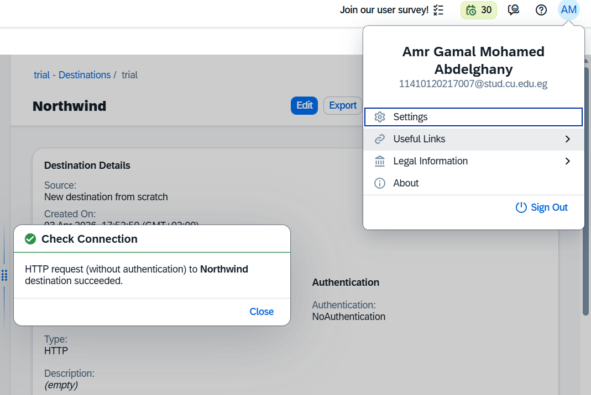
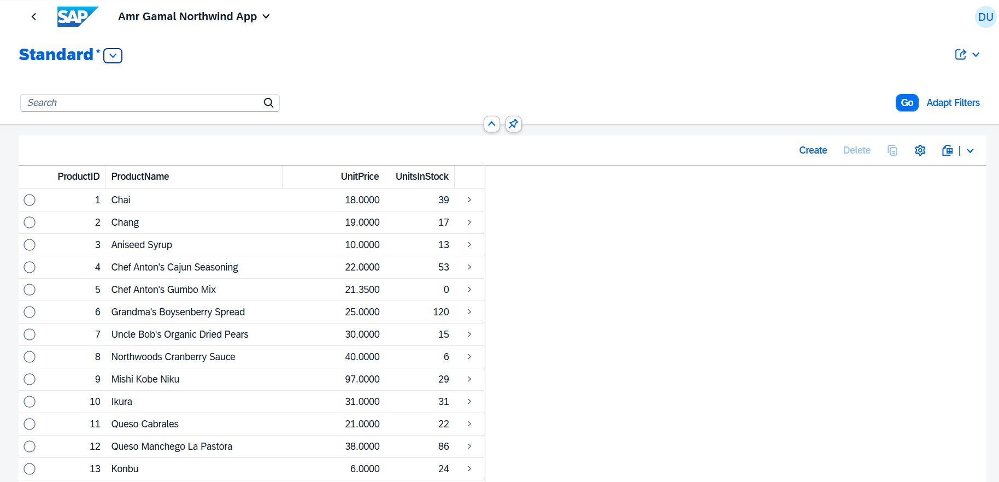
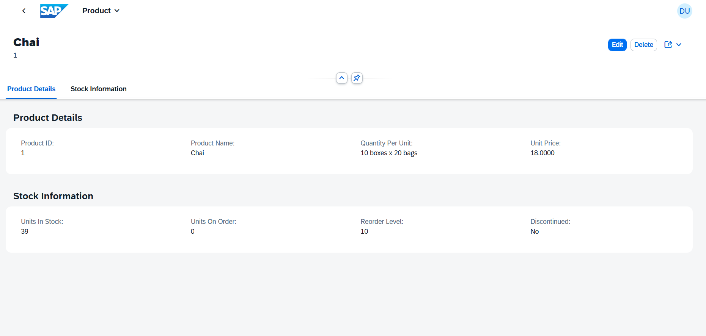
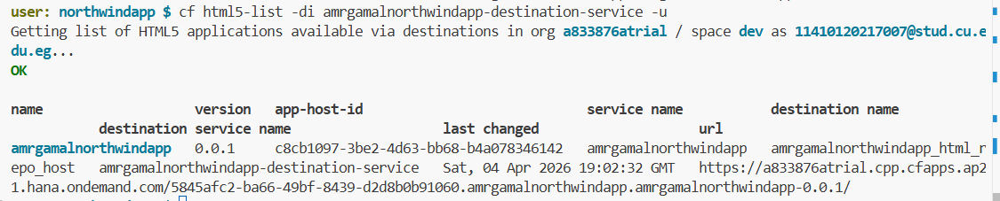
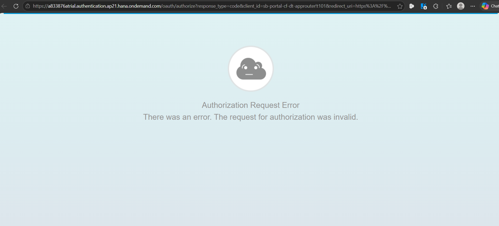
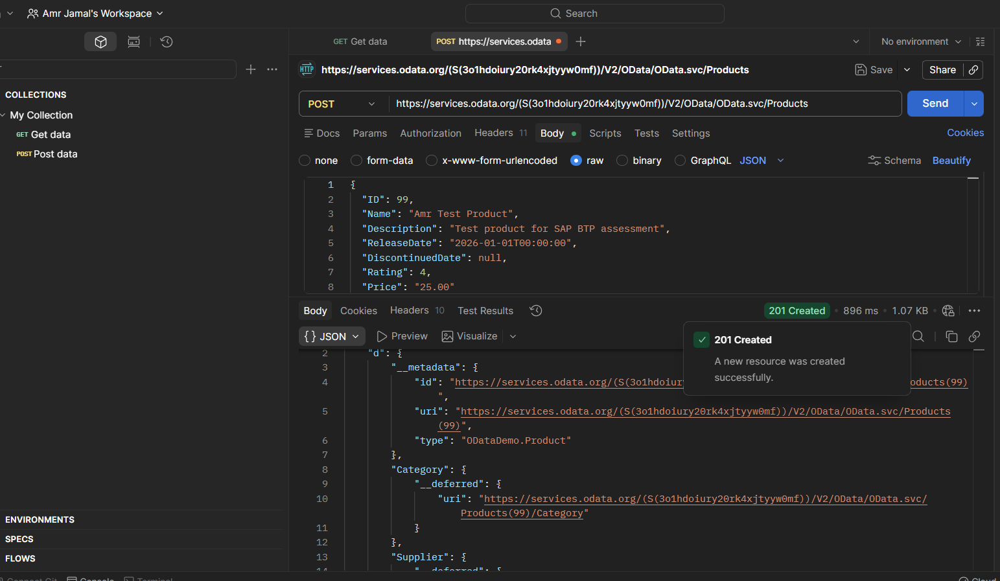

```markdown
# Amr Gamal Northwind App

A SAP Fiori List Report application built on SAP Business Technology Platform (BTP) that displays 
product data from the Northwind OData service. The application allows users to browse a live product 
catalogue in a responsive list view and drill down into full product details via an Object Page. 
It is deployed to SAP BTP Cloud Foundry and protected by XSUAA authentication.

---

## Architecture Overview

The application is built using three core SAP BTP components that work together:

- **SAP Business Application Studio (BAS)** is the cloud-based IDE where the Fiori application 
  was built, annotated, and previewed. BAS connects to the Northwind OData service through a 
  named Destination rather than a hardcoded URL.

- **Destination Service** acts as a secure, centrally managed pointer to the external Northwind 
  OData service at `https://services.odata.org`. By referencing the destination by name, the 
  application follows SAP BTP best practices and avoids exposing backend URLs directly in code.

- **Cloud Foundry** is the runtime platform where the application is deployed. The app is packaged 
  as an MTA (Multi-Target Application) archive using the MTA Build Tool, then deployed via the 
  CF CLI. Once deployed, it is accessible via a public HTTPS URL and protected by the 
  Authorization and Trust Management Service (XSUAA).

---

## Setup Instructions

Follow these steps exactly to reproduce this environment from scratch:

### Step 1 — Create SAP Universal ID
- Go to: https://account.sap.com/core/create/register
- Fill in your details and submit
- Verify your email address before continuing

### Step 2 — Create SAP BTP Trial Account
- Go to: https://account.hanatrial.ondemand.com
- Sign in using your SAP Universal ID
- Accept the trial setup and wait for your account to be provisioned

### Step 3 — Enable Cloud Foundry Environment
- In BTP Cockpit, navigate to your Trial Subaccount
- Go to **Cloud Foundry Environment** and click **Enable Cloud Foundry**
- Create a space named `dev`
- Note your API Endpoint, Org Name, and Space Name

### Step 4 — Subscribe to Required Services
- Go to **Service Marketplace**
- Subscribe to **SAP Business Application Studio**
- Go to **Security → Users**, click your user, and assign the role collection:
  `Business_Application_Studio_Developer`

### Step 5 — Configure Northwind Destination
- Go to **Connectivity → Destinations**
- Click **New Destination** and enter the following:

| Field | Value |
|-------|-------|
| Name | Northwind |
| Type | HTTP |
| URL | https://services.odata.org |
| Authentication | NoAuthentication |
| Proxy Type | Internet |

- Add these **Additional Properties**:

| Key | Value |
|-----|-------|
| WebIDEEnabled | true |
| WebIDEUsage | odata_gen |

- Click **Check Connection** to verify it is reachable

### Step 6 — Build the Fiori Application in BAS
- Launch **SAP Business Application Studio** from Instances & Subscriptions
- Create a new **Dev Space** of type **SAP Fiori** and wait for it to start
- Open the **Fiori Application Generator** wizard
- Select template: **List Report Page**
- Data source: **Connect to an OData Service**
- OData Service URL: `https://services.odata.org/V2/Northwind/Northwind.svc/`
- Main entity: **Products**
- Select columns: `ProductID`, `ProductName`, `UnitPrice`, `UnitsInStock`, `Discontinued`
- Set application title: `Amr Gamal Northwind App`
- Set namespace: `amr.gamal`

### Step 7 — Add UI Annotations
Since Northwind does not ship with SAP UI annotations, manually create
`webapp/annotations/annotation.xml` with `UI.LineItem`, `UI.HeaderInfo`, 
`UI.Facets`, and `UI.FieldGroup` definitions for the Products entity.

### Step 8 — Run Preview
```bash
npm start
```

### Step 9 — Deploy to Cloud Foundry
```bash
# Login to Cloud Foundry
cf login -a https://api.cf.ap21.hana.ondemand.com

# Build the MTA archive
mbt build

# Deploy
cf deploy mta_archives/amrgamalnorthwindapp_0.0.1.mtar

# Verify deployment
cf html5-list -di amrgamalnorthwindapp-destination-service -u
```

---

## OData Entity Used

**Entity Set:** `Products`

The Products entity was selected because it contains the most complete and meaningful set of 
fields in the Northwind service: `ProductID`, `ProductName`, `QuantityPerUnit`, `UnitPrice`, 
`UnitsInStock`, `UnitsOnOrder`, `ReorderLevel`, and `Discontinued`. This breadth of fields makes 
it ideal for demonstrating both a List Report (tabular overview) and an Object Page (full record 
detail), closely mirroring a real-world product catalogue scenario that SAP BTP developers 
encounter in consulting engagements.

---

## Challenges Faced

### Challenge 1 — Missing UI Annotations
**Problem:** After connecting to the Northwind service, the BAS wizard displayed the warning:
> "No UI Annotation defined for entity type Product. UI.LineItem annotation has not been defined."

The Northwind service is a generic public OData endpoint and does not ship with SAP-specific 
UI vocabulary annotations, which the Fiori List Report template requires to render columns 
and page sections.

**Resolution:** Manually authored a complete `annotation.xml` file in `webapp/annotations/` 
defining `UI.LineItem` (list columns), `UI.HeaderInfo` (object page title), `UI.Facets` 
(page sections), and two `UI.FieldGroup` blocks (Product Details and Stock Information). 
This resolved all annotation errors and allowed both the List Report and Object Page 
to render live data correctly.

### Challenge 2 — Cloud Foundry API Endpoint Mismatch
**Problem:** Running `cf target -o a833876atrial` returned "Organization not found" even 
after a successful `cf login`. The default API endpoint `api.cf.us10-001.hana.ondemand.com` 
did not match the region where the trial account was provisioned.

**Resolution:** Located the correct API endpoint (`https://api.cf.ap21.hana.ondemand.com`) 
by navigating to the BTP Cockpit Subaccount Overview page, which displays the CF environment 
region. Re-running `cf login` with the `-a` flag pointing to the correct endpoint resolved 
the issue immediately.

### Challenge 3 — MTA Archive Filename Mismatch
**Problem:** The deploy command `cf deploy mta_archives/northwindapp_0.0.1.mtar` failed 
with "Could not find MTA" because the actual generated archive was named 
`amrgamalnorthwindapp_0.0.1.mtar` — the MTA ID from `mta.yaml` prefixes the filename, 
not the project folder name.

**Resolution:** Read the `mbt build` output logs which clearly stated the generated archive 
path. Updated the deploy command to use the correct filename.

---

## Bonus Tasks Completed

| Bonus | Task | Status | Outcome |
|-------|------|--------|---------|
| B1 | Deploy to Cloud Foundry | ✅ Completed | App successfully built with `mbt build` and deployed with `cf deploy`. Accessible via public HTTPS URL. |
| B2 | Test OData via Postman | ✅ Completed | All 4 query options demonstrated: `$top`, `$filter`, `$select`, `$orderby`. Screenshots and collection included in `/docs`. |
| B3 | XSUAA Authentication | ✅ Completed | App automatically redirects unauthenticated users to SAP authorization endpoint. Screenshot of auth prompt included. |
| B4 | Fiori Object Page | ✅ Completed | Clicking any product row in the list navigates to a detail page showing all fields across two sections. |
| B5 | OData POST via Postman | ✅ Completed | POST request against writable OData mock service returned `201 Created` with full response body. |
| B6 | SAP Build Work Zone | ❌ Not Completed | SAP BTP Trial accounts do not include an SAP Cloud Identity Services tenant, which is a prerequisite for Work Zone subscription. The subscription failed with: "You haven't configured your subaccount to trust a tenant of SAP Cloud Identity Services." This is a known trial account platform limitation. |

---

## Deployed Application URL

```
https://a833876atrial.cpp.cfapps.ap21.hana.ondemand.com/5845afc2-ba66-49bf-8439-d2d8b0b91060.amrgamalnorthwindapp.amrgamalnorthwindapp-0.0.1/
```

> Note: The application is protected by XSUAA. Accessing the URL will redirect to the 
> SAP authentication endpoint. This is the expected and intended behaviour as configured 
> during deployment.

---

## Screenshots

| Screenshot | Description |
|------------|-------------|
|  | Northwind destination configured in BTP Cockpit with connection check passed |
|  | Fiori List Report running in BAS preview showing live Northwind product data |
|  | Object Page showing full product details after clicking a list row |
|  | Terminal output of `cf html5-list` confirming deployment and public URL |
|  | SAP XSUAA authorization prompt on the deployed application URL |
|  | Postman POST request to writable OData service returning 201 Created |
|  | Postman `$top=5` query returning first 5 products |
|  | Postman `$filter=Discontinued eq true` returning discontinued products only |
|  | Postman `$select` query returning only ProductID, ProductName, UnitPrice |
|  | Postman `$orderby=UnitPrice desc` returning products sorted by price descending |

---

## Application Details

| Property | Value |
|----------|-------|
| App Generator | SAP Fiori Application Generator |
| Generator Version | 1.22.0 |
| Generation Platform | SAP Business Application Studio |
| Template | List Report Page V2 |
| Service URL | https://services.odata.org/V2/Northwind/Northwind.svc/ |
| Module Name | northwindapp |
| Application Title | Amr Gamal Northwind App |
| Namespace | amr.gamal |
| UI5 Version | 1.146.0 |
| Main Entity | Products |
| TypeScript | Disabled |

---

## Running Locally

```bash
# Install dependencies
npm install

# Start with live OData service
npm start

# Start with mock data
npm run start-mock
```

**Prerequisite:** Node.js LTS and npm installed. See https://nodejs.org
```